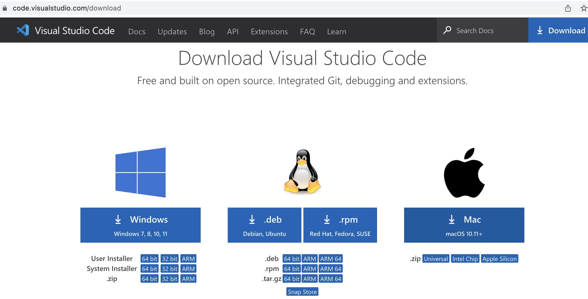
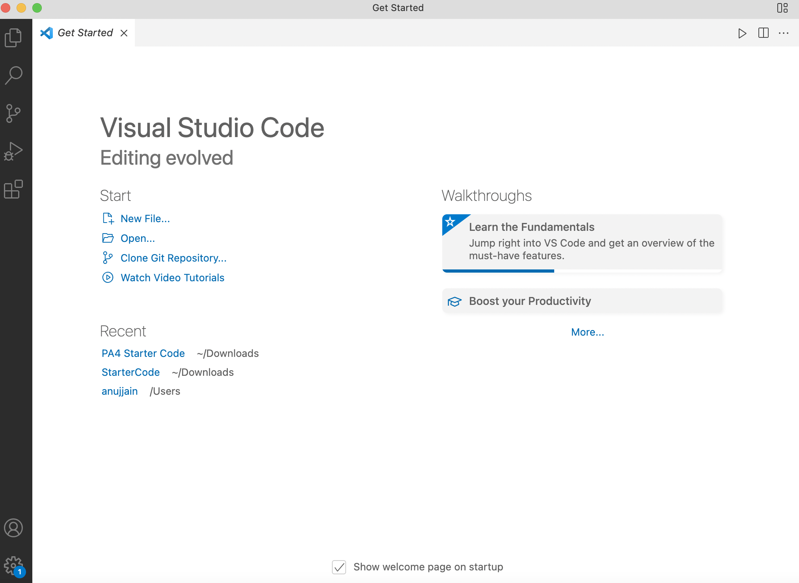
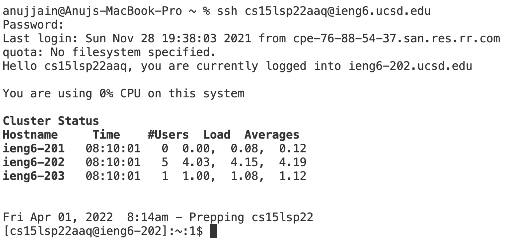
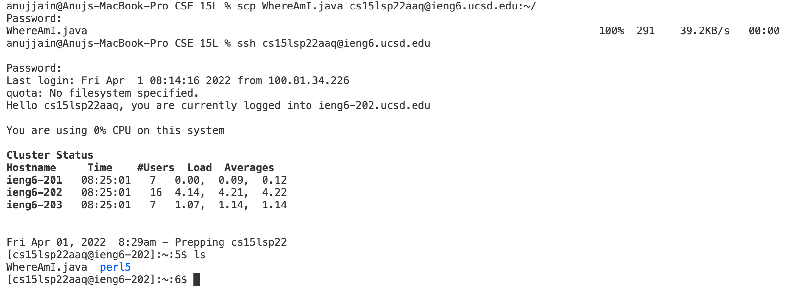

# Remote Access Tutorial
**Step 1** : Download Visual Studio code from [Link](https://code.visualstudio.com/download)
 
**Step 2**: 
* 1) Terminal → New Terminal menu option
* 2) Type ssh cs15lsp22zz@ieng6.ucsd.edu where zz is replaced by your username letters.
* 3) When Prompted for surety to continue, type *yes*. Then enter the password.

**Step 3** : 
Try using some commands in terminal :
      For Example,  ls and ls < directory > : 
      Here, List of folders in group is only perl5 so commands ls and ls <directory> gives same output
 
