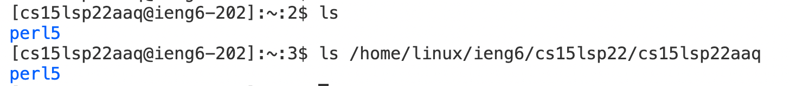
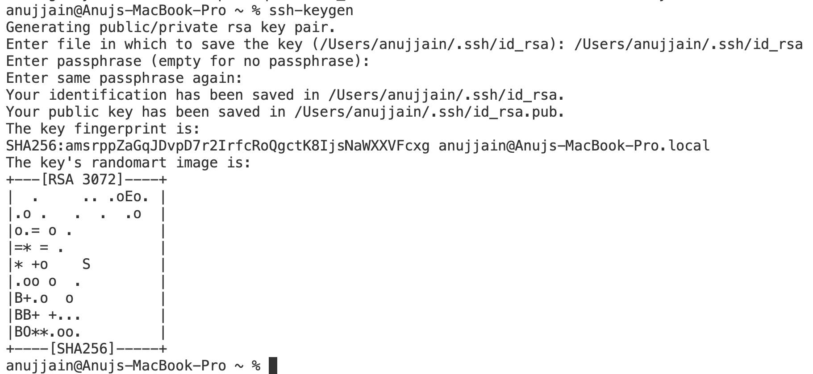
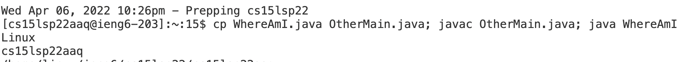
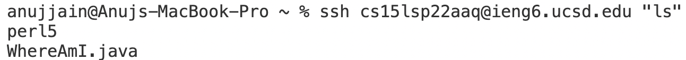

# Remote Access Tutorial
## Step 1 : Download Visual Studio code from [Link](https://code.visualstudio.com/download)
 
## Step 2: 
* 1) Terminal → New Terminal menu option
* 2) Type ssh cs15lsp22zz@ieng6.ucsd.edu where zz is replaced by your username letters.
* 3) When Prompted for surety to continue, type *yes*. Then enter the password.

## Step 3: 
Try using some commands in terminal :
* For Example,  ls and ls < directory > : 
* Here, List of folders in group is only perl5 so commands ls and ls <directory> gives same output

## Step 4:
Copying files from your own desktop to server.
* 1) Writing the code first ,
* 2) Using scp to copy
* 3) logging into server using ssh and username
* 4) checking the list on server using ls command
* 5) Logging out using exit

## Step 5 : To avoid using password again and again after using commands like scp, we setup a public key ( on server ) and private key ( on desktop ) 
* 1) Type ssh-keygen
* 2) Enter file when prompted. Here,

   Enter file in which to save the key (/home/linux/ieng6/cs15lsp22/cs15lsp22aaq/.ssh/id_rsa): /home/linux/ieng6/cs15lsp22/cs15lsp22aaq/.ssh/id_rsa

## Step 6: Optimizing Remote Running

* To use commands already used earlier ( or snippets of it ) , click UP arrow key. 
* To enter multiple commands in a single line, use semicolon as a separator.
* To run a command directly on the server, type ssh <username> “<command>”
      
      
