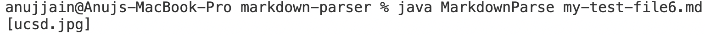

# Debugging Practice
## Error 1
For test file [Link4](https://github.com/Anujjain2579/markdown-parser/blob/main/my-test-file4.md) **with text after the Link**, containing following error is encountered :

Runs infinitely and thus run out of heap space.
To overcome, we make the following changes : [Link1](https://github.com/Anujjain2579/markdown-parser/commit/2eb889514d621a52fb94794f14110248b02e7413)
* Add if - Break statement so that compiler does not keep checking file if no brackets or Parentheses is found.

## Error 2
For test file containing Array with no links [Link5](https://github.com/Anujjain2579/markdown-parser/blob/main/my-test-file5.md)

* The format capture text which is not a link. Link should mandatorily has " . " in it.
* To overcome : [Link2](https://github.com/Anujjain2579/markdown-parser/commit/14c3c3d59d5d1657be6e3f551694c2e2a42c5c45)
* We add if statement to check dot and move the toReturn.add inside if block.

## Error 3
For test file with images instead of link [Link6](https://github.com/Anujjain2579/markdown-parser/blob/main/my-test-file6.md)

* Since format is almost similar in markdown for image and Links, image is captured as link while parsing.
* To overcome : [Link3](https://github.com/Anujjain2579/markdown-parser/commit/38468757fda8b69b551ef99be6f23ff67f1f8e98)
* Check for presence of exclamation mark ! . If present with brackets, ignore text inside and continue looping to find next Link.
* 
