## Streamlining Server
**Configure File with ieng6 as alias**
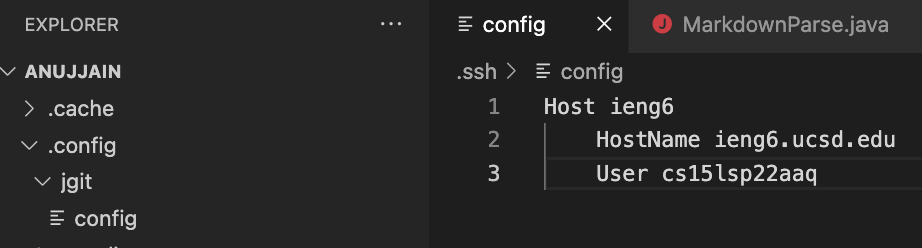
**Using the alias**
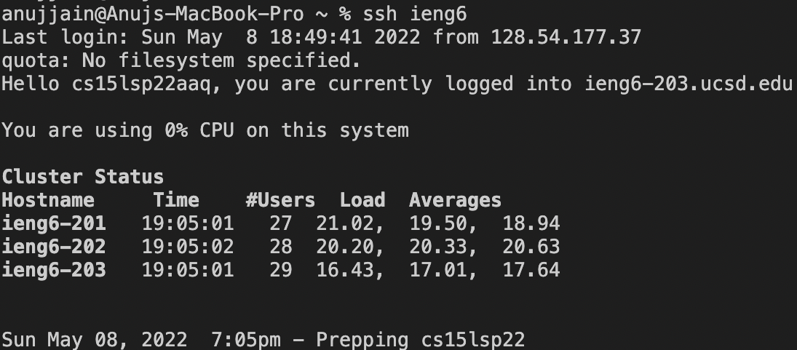
**Using Alias for copying a new file (NeFile.java) with scp**
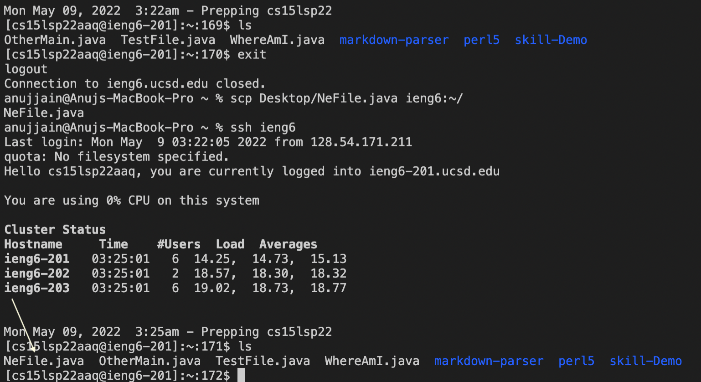
**New public/private key generation using ssh-keygen**
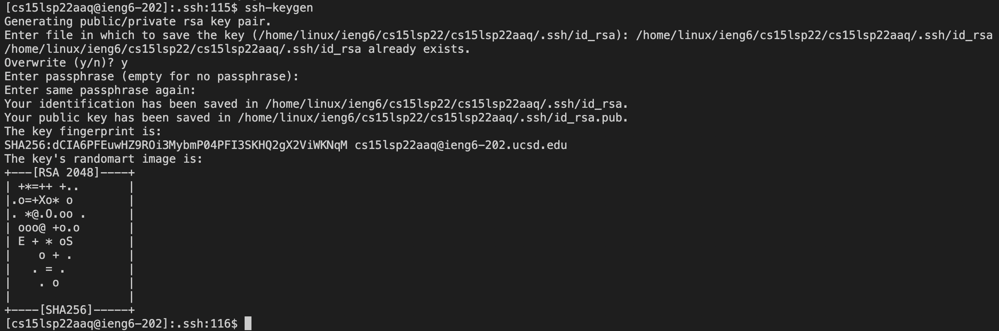
**Display public key using cat command**
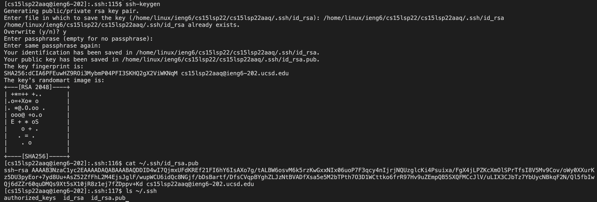
**Place of private key is inside .ssh with name id_rsa**
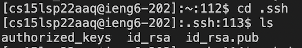
**Adding public key to the Github Profile**
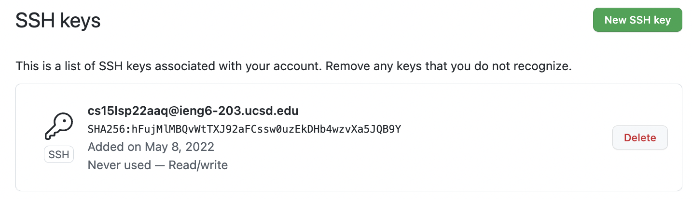
**Copying whole markdown-parse directory into ieng6 server**
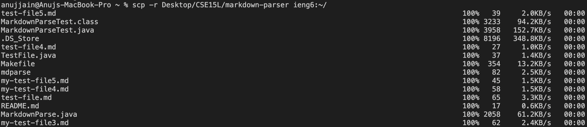
**Logging and testing the markdownparse in ieng6 server**
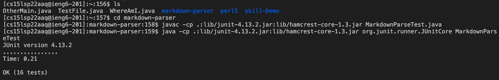
**Performing above 2 operations in single line**
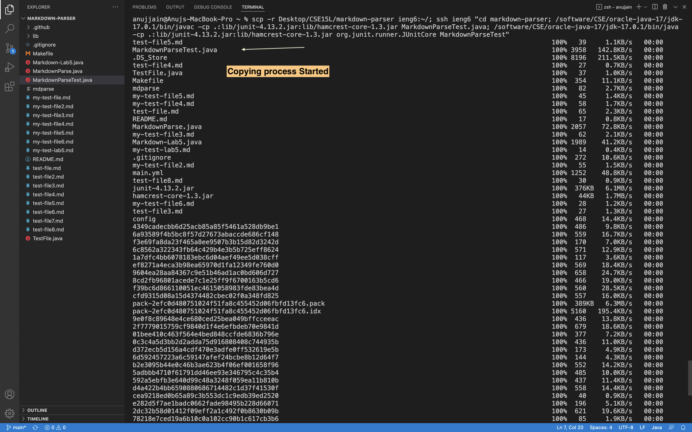
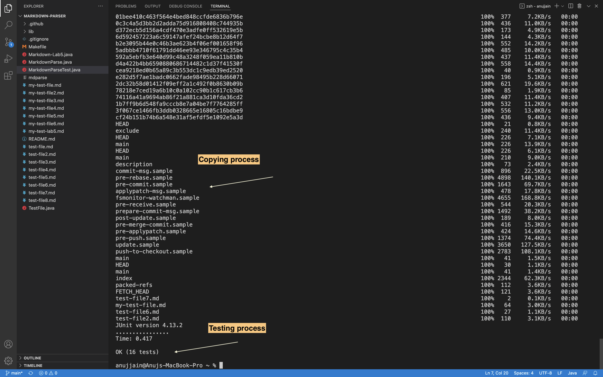
