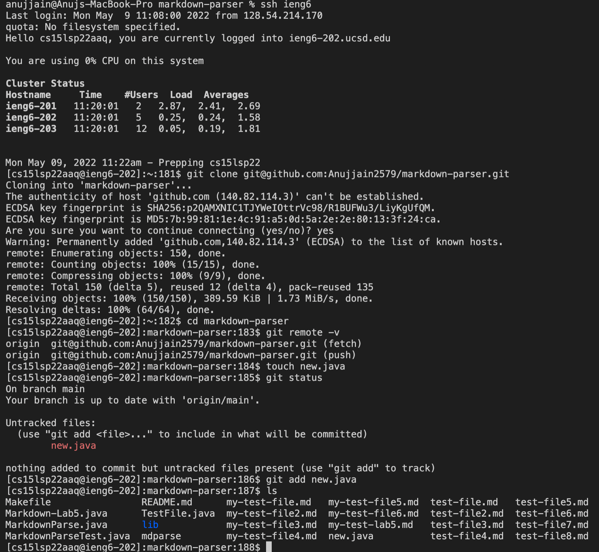
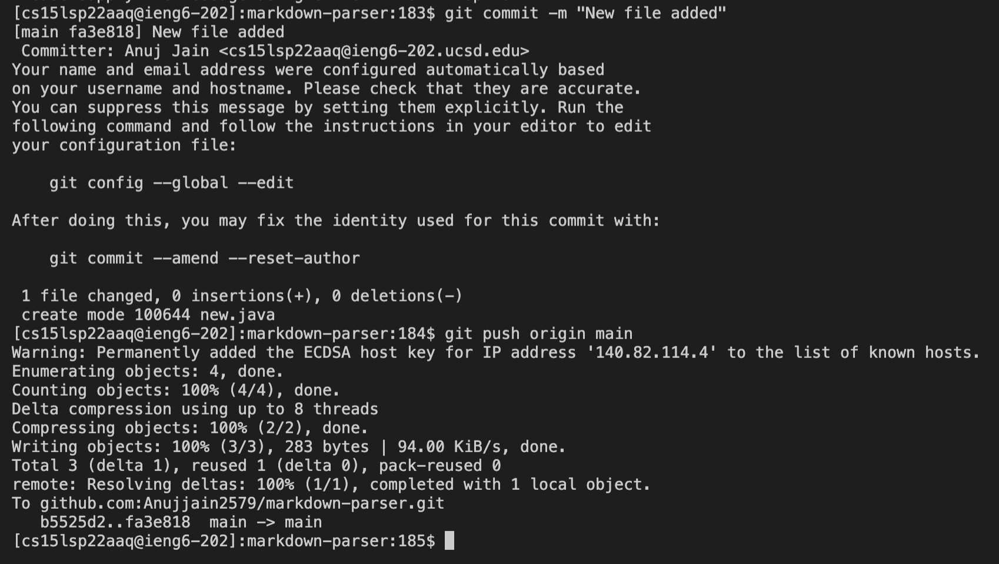

## Streamlining Server
### **Configure File with ieng6 as alias**

### **Using the alias**

### **Using Alias for copying a new file (NeFile.java) with scp**

### **New public/private key generation using ssh-keygen**

### **Display public key using cat command**

### **Place of private key is inside .ssh with name id_rsa**

### **Adding public key to the Github Profile**

### **Making a new file in ieng6 server**

### **Adding and Commiting file to github**

### **Copying whole markdown-parse directory into ieng6 server**

### **Logging and testing the markdownparse in ieng6 server**

### **Performing above 2 operations in single line**

