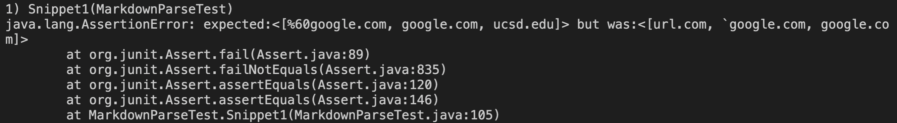
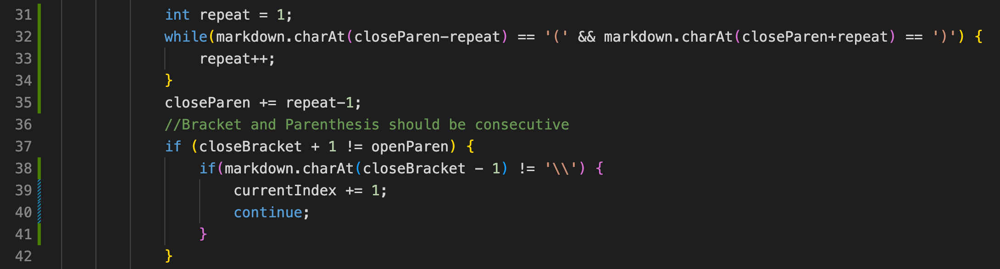
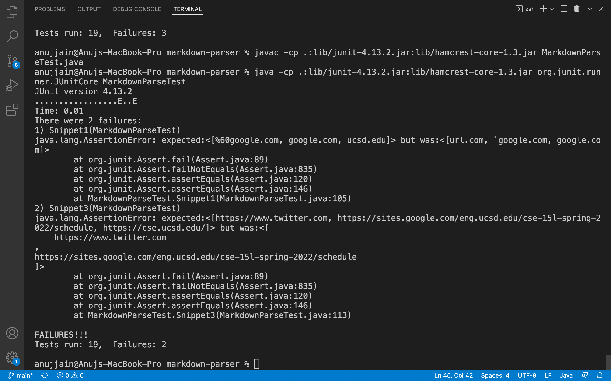
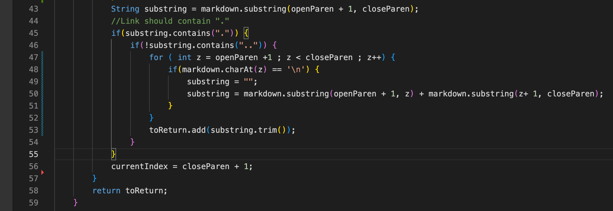
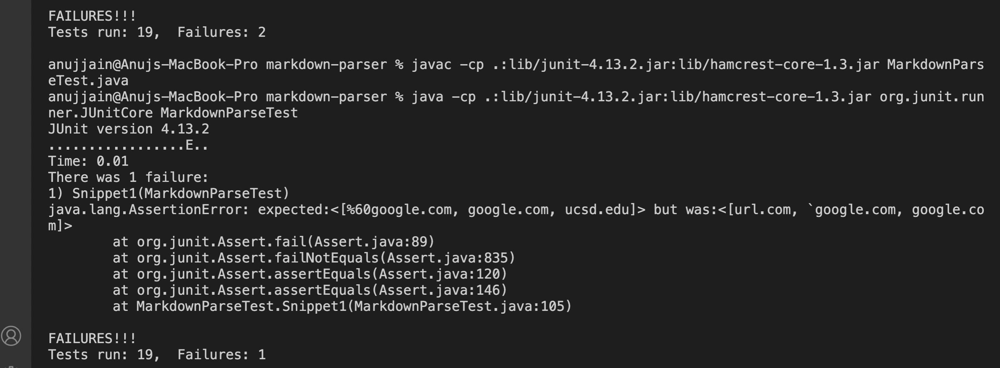

# Edit for more Snippets
## My Markdown-parser
### Initial Failure in all 3 Code Snippets

**My code does not consider special cases being tested in given 3 code snippets, hence failed.** 
### Changes made to pass Snippet 2

**This whole change was just 9 lines of code.** 
*For case of nested parentheses, I check if opening and closing parenthesis occur to the left and right (respectively) of first occurence of close Paren.
I count the number of times it occurs ( variable repeat ) and add it to closeParen. Thus, now link would be read uptil last occurence of close Parentheses ( if nesting was present).* 
The presence of backslash means to ignore the close Bracket and rather consider the following as link.
For it, I added the if statement before continue statement.
### Run after change

**This whole change was just 7 lines of code.** 
*To overcome the long texts, I found the index of new line character \n. Then we break link into 2 parts and merge again leaving \n. For extra spaces, I used trim() method just before adding the string.*
### Changes made to pass Snippet 3

### Run after change

