# Edit for more Snippets

*Repository to share ( My own):* [Link-Shared](https://github.com/Anujjain2579/markdown-parser.git)

*Repository to review:* [Link-Reviewed](https://github.com/ddn005UCSD/markdown-parser)
### Tests added to both repositories
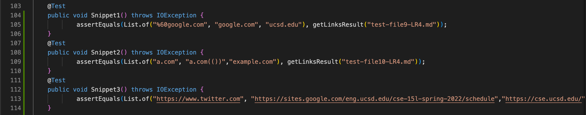
### Initial Failure in all 3 Code Snippets - Shared
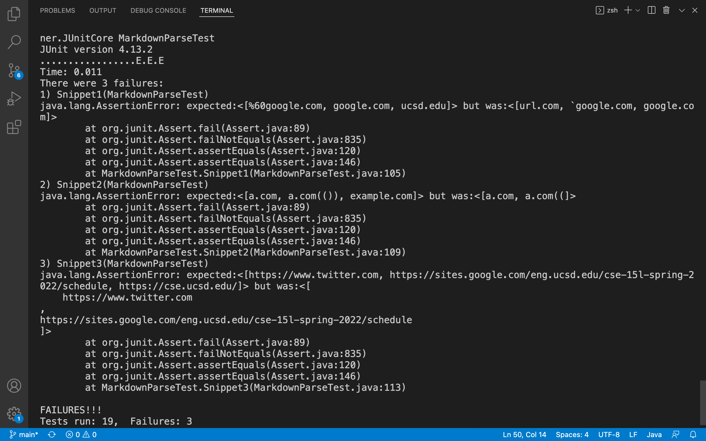
### Initial Failure in all 3 Code Snippets - Reviewed

**My code does not consider special cases being tested in given 3 code snippets, hence failed.** 
## Snippet 2
Expected Result 
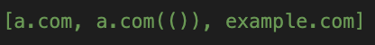
### Failure in reviewed Code
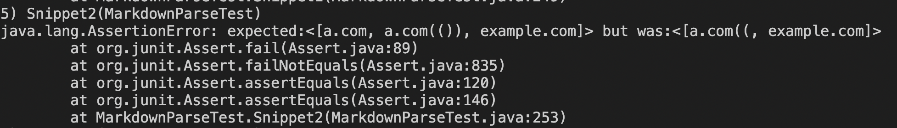
### Failure in shared Code
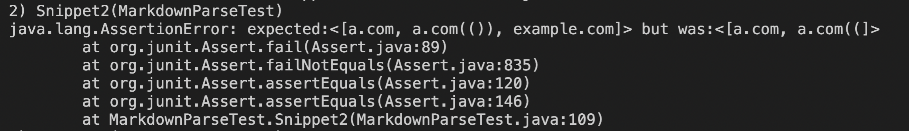
### Changes made to pass Snippet 2 - Shared

**This whole change was just 9 lines of code.** 
*For case of nested parentheses, I check if opening and closing parenthesis occur to the left and right (respectively) of first occurence of close Paren.
I count the number of times it occurs ( variable repeat ) and add it to closeParen. Thus, now link would be read uptil last occurence of close Parentheses ( if nesting was present).* 
The presence of backslash means to ignore the close Bracket and rather consider the following as link.
For it, I added the if statement before continue statement.
### Run after change
Passed Snippet 2 Test

## Snippet 3
Expected Result
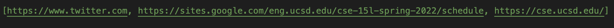
### Failure in reviewed Code
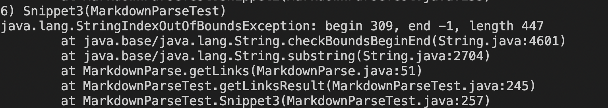
### Failure in shared Code
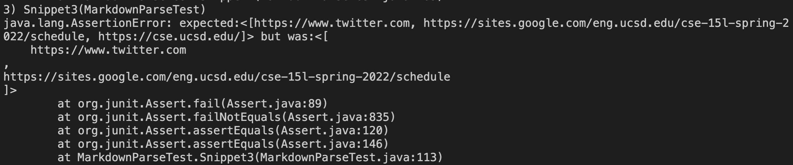
### Changes made to pass Snippet 3

**This whole change was just 7 lines of code.** 
*To overcome the long texts, I found the index of new line character \n. Then we break link into 2 parts and merge again leaving \n. For extra spaces, I used trim() method just before adding the string.*
### Run after change
Passed Snippet 3 Test

## Snippet 1
Expected Result
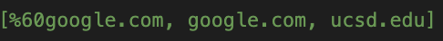
### Failure in reviewed Code
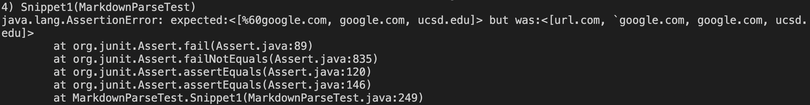
### Failure in shared Code

**For considering backticks, I need to consider enclosed string as a code block which requires change in bunch of code lines. The following alone will not work (as in above cases) since it fails other tests. The presence of backticks are in both Brackets and Parenetheses which makes it difficult. Another part that is necessary to incorporate is to read backtick as %60 (ASCII code) in 2nd link.**
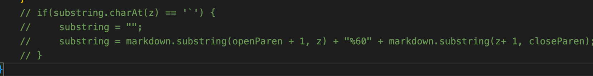
