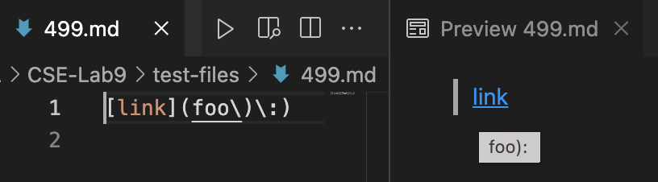
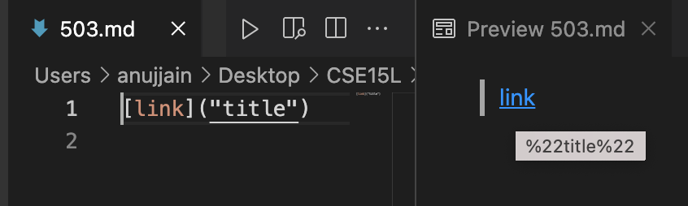
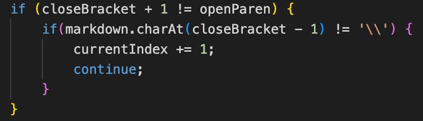
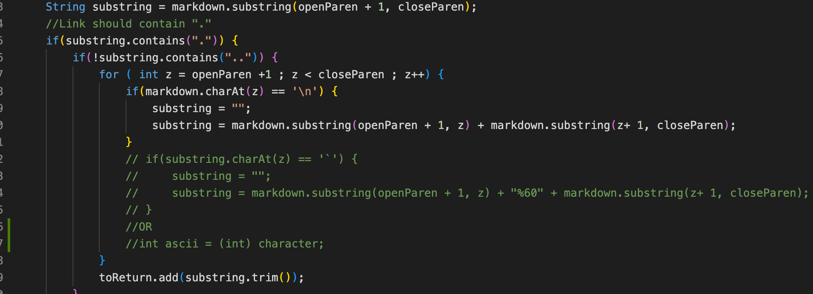

# VimDiff for Links
**I used vimdiff on the results of running a bash for loop**
### Link to files with different results :
[File499](https://github.com/nidhidhamnani/markdown-parser/blob/main/test-files/499.md)
[File503](https://github.com/nidhidhamnani/markdown-parser/blob/main/test-files/503.md)
### File 499
Both implementations reads File 499's link incorrectly. This is because we need to ignore characters preceeded by backslash.
Our outputs : Left is my MarkdownParse and right is by the LAB 9's given repository

Correct output should be :

### File 503
My implementation does not read the character # and hence misses the link.
The given MarkdownParse.java does read the link but does not convert " to its hexadecimal ASCII code.

The correct ouput should be :

## To overcome above errors in getting links, we should consider editing following :
**1. Adding if statement that checks the presence of backslash before any bracket or parentheses.
  I just added for brackets in my Markdown Parse.java during Lab 7. Additionally it should be for parentheses also**
  

**2. Converting special characters to their ASCII code and consider # within link.
  For Lab 7, I tried converting backticks to their ASCII code and read them within link. Similarly, we should do for other characters.**

*Thanks for supporting throughout the Quarter!*

